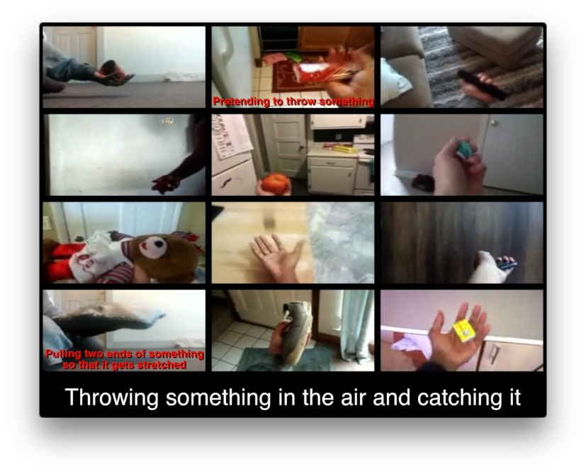

# Temporal Relation Networks
In this repo, we will release the code and pre-trained models of temporal relation networks in PyTorch.

### Demo Video
[](https://www.youtube.com/watch?v=D42erLb42_k)

### Code and Model
In preparation...

### Reference:
B. Zhou, A. Andonian, and A. Torralba. Temporal Relational Reasoning in Videos. arXiv:XXX, 2017
```
@article{zhou2017temporalrelation,
    title = {Temporal Relational Reasoning in Videos},
    author = {Zhou, Bolei and Andonian, Alex and Torralba, Antonio},
    journal={arXiv:xxx},
    year={2017}
}
```
